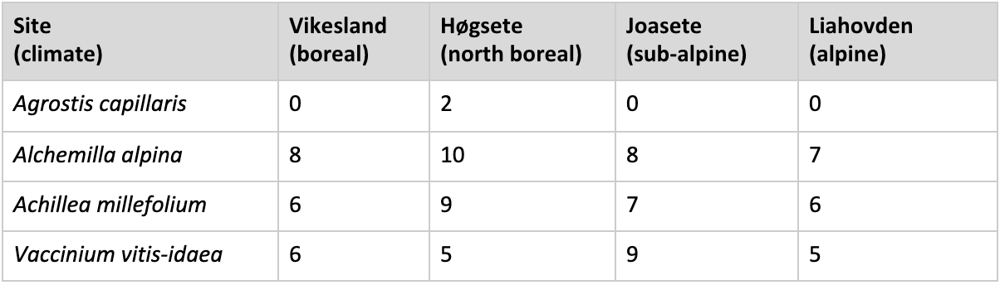
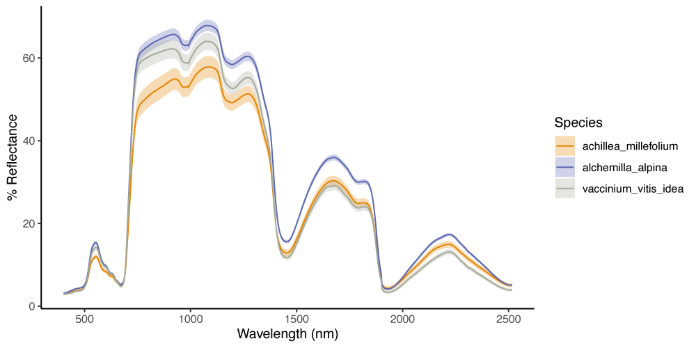
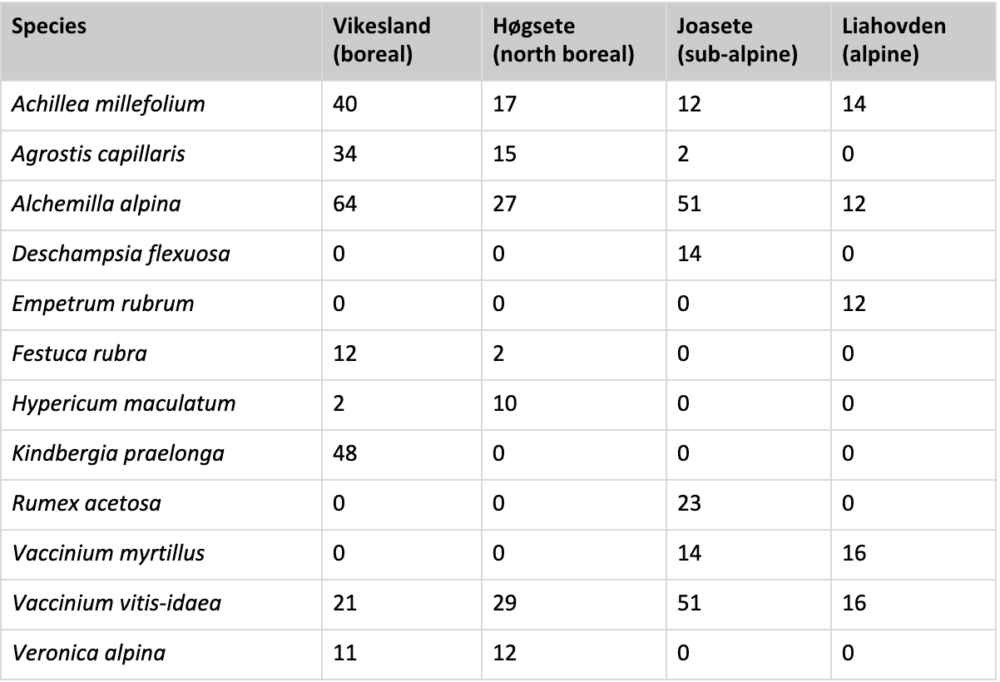
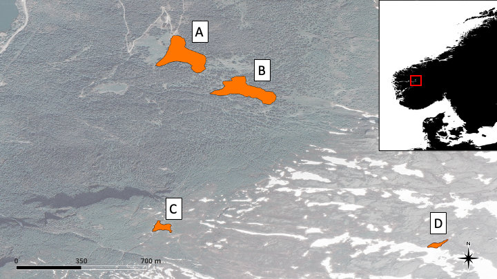
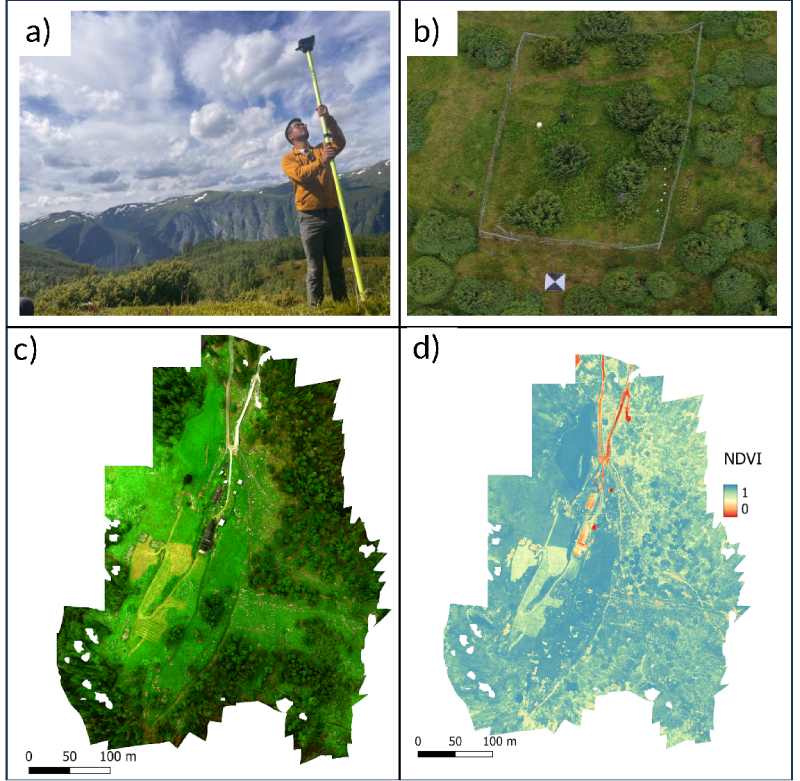

# Readme file

This repository contains the cleaning code and reports on data from the
PFTC6 Course in south-western Norway. This git repository is associated
with the data paper: Vandvik et al. (2015). Plant traits and associated
ecological data from global change experiments and climate gradients in
Norway. Scientific Data. Here we describe the organization and structure
of the data and describe each dataset in some detail. For more details
on the methods, data dictionaries, data validation and usage note see
Vandvik et al. 2015.

## Summary

Plant functional trait-based approaches are powerful tools to assess the
consequences of global environmental changes for plant ecophysiology,
population and community ecology, ecosystem functioning, and landscape
ecology. Here, we present data capturing these ecological dimensions
from grazing, nitrogen addition, and warming experiments conducted along
a 821 m a.s.l. elevation gradient and from a climate warming experiment
conducted across a 3,200 mm precipitation gradient in boreal and alpine
grasslands in Vestland County, Norway. From these systems we collected
28,762 plant and leaf functional trait measurements from 76 vascular
plant species, 88 leaf assimilation-temperature responses, 577 leaf
handheld hyperspectral readings, 2.26 billion leaf temperature
measurements, 3,696 ecosystem CO2 flux measurements, and
10.69 ha of multispectral (10-band) and RGB cm-resolution imagery from
4,648 individual images obtained from airborne sensors. These data
augment existing longer-term data on local climate, soils, plant
populations, plant community composition, and ecosystem functioning from
within the same experiments and study systems. The resulting integrated
datasets provide unique opportunities for testing ecological theory and
assessing plant and ecosystem responses and feedbacks to multiple global
change drivers.

<figure>

<figcaption aria-hidden="true"><em>Figure 1 Map of sites and conceptual
diagram of the experimental and study designs for the three study
systems sampled for plant functional traits and associated data in the
PFTC6 field campaign. (a) Location and study design of the Elevation
Gradient and experimental design of the Global Change Experiment along a
mountainside in Aurland, Vestland County, Norway. Colours (yellow,
green, blue, purple) indicate the four sites. The Elevation gradient
study system includes a natural grazing (sheep) treatment a fenced
ungrazed control (C) and at each of the four sites. The Global Change
Experiment study system includes these grazing treatments and four
nitrogen addition treatments inside the ungrazed fenced area (5, 10, 50
and 150 kg N ha-1 yr-1; greyscale) in combination
with a warming treatment (box transplant arrow) whereby whole-community
turfs of all grazing and nitrogen treatments from the colder sites
(alpine Liahovden or subalpine Joasete) are transplanted a 3℃ ‘step’
warmer along the elevation gradient (to the subalpine Joasete and boreal
Vikesland, respectively). On the figure, ambient climate treatments are
indicated by a solid outline, warmed treatments by a dashed outline. See
text for details of the hierarchical block design and replication. Note
that the Global Change Experiment is based on a field experiment
established in the ThreeD project, and the Elevation Gradient combines
sites and grazing exclosure treatments from the ThreeD and Vestland
Climate Grid projects, so that these study systems use the same plots
for the ambient climate fenced control and the natural grazing
treatments in the alpine Liahovden and subalpine Joasete sites (see
Table 2 and text below). m a.s.l. = metres above sea level. (b) Map of
southern Scandinavia with the location of the study region (dashed
rectangle) and the mountainside harbouring the Elevation Gradient and
Global Change Experiment (small circle) indicated. (c) Map of the study
region with the three sites of the Warming Experiment study system
indicated by Hexagonal Open Top Chambers. The hatched box indicates the
location of the mountainside harbouring the Elevation Gradient and
Global Change Experiment. Note that the Warming Experiment is based on a
field experiment established in the INCLINE project (see Table 2 and
text below), with paired adjacent warmed and ambient climate plots at
each site. See text for details of the hierarchical block design and
replication. Bluescale reflects mean annual precipitation calculated
from daily means from 2009-2019, data provided by the Norwegian
Meteorological Institute (www.met.no).</em></figcaption>
</figure>

## Data records

This paper reports on plant functional traits and associated data on
leaf and ecosystem carbon fluxes, and thermal, multi- and hyperspectral
imagery from three study systems; an Elevation Gradient, a Global Change
Experiment, and a Warming Experiment. The data were collected in boreal,
sub-alpine, and alpine grassland vegetation in Western Norway by the
PFTC6 plant traits course during peak growing season in 2022 (Fig. 1).

Data outputs consist of seven datasets. The core dataset (i) consists of
plant functional trait data representing the plant community of the
Elevation Gradient and Global Change Experiment, and 16 preselected
focal species plus additional dominant species across the four Warming
Experiment sites, along with additional trait measurements made to match
traits to the other datasets collected. At the leaf-level, we report on
(ii) leaf assimilation-temperature responses, (iii) leaf handheld
hyperspectral readings, and (iv) canopy leaf temperatures from the
Elevation Gradient. At the ecosystem level, we report on (v) diurnal
ecosystem carbon fluxes from control and warmed plots in the Global
Change Experiment, (vi) landscape-scale airborne multispectral imagery
covering the Global Change Experiment and Elevation Gradient, and (vii)
microclimate data from control and warmed plots in the Global Change
Experiment and the Elevation Gradient (Table 1). Each dataset includes
the focal response variable(s) (i-vii) along with associated study
design, global change treatment, and climate variables (Fig. 2, Table
1).

<figure>

<figcaption aria-hidden="true"><em>Table 1 Description and location of
the datasets. This table summarises information on dataset number,
response variable(s), number of observations, temporal range of the
data, and location of the primary data, the final published data, and
the code for extracting and cleaning data from the primary data.
Superscripts refer to atotal number of observations in the data (i.e.,
data points), and bnumber of taxa for which we have data. Note that
chemical trait analyses are still in progress, and the planned final
numbers are 8,574 measurements from 60 species. The OSF repository will
be updated to include these measurements.</em></figcaption>
</figure>

### Data organization and structure

The final clean data files are available on OSF1,3. All files
are named using the following naming structure:
nr_PFTC6_clean_experiment_variable_year(s).csv. The nr refers to the
roman dataset number in Table 1; experiment refers to the Elevation
Gradient, Global Change Experiment or Warming Experiment; the variable
corresponds to the response variable using the terminology in Table 1.
All datasets are structured similarly, sharing some common variables
including year, date, siteID, blockID, plotID, turfID, and treatments
and specific variables that are unique to each dataset (Fig. 2). The
shared variables can be used to link different datasets, for example to
combine them for specific analysis (bold letters in Fig. 2).

The code necessary to access the raw data and produce cleaned datasets,
along with explanations of the various data cleaning steps, issues, and
outcomes, are available in open GitHub repositories, with versioned
copies archived in Zenodo2,4,5,6. The raw data files are also
available at Open Science Framework (OSF)1,3 and are stored
in a folder called “raw_data”. In this folder there is a separate folder
for each dataset containing several raw data files. The folder is named
using the roman letter corresponding to Table 1. The Usage Notes section
in this paper summarises the data accuracy and data cleaning procedures,
including explanations of and advice on how to deal with various
comments and flags in the data, caveats regarding data quality, and our
advice on ‘best practice’ data usage. The reader is referred to the code
and the detailed coding, data cleaning, and data accuracy comments and
the associated raw and cleaned data and metadata tables below for
further information.

<figure>

<figcaption aria-hidden="true"><em>Figure 2 Data structure for the plant
functional trait and associated datasets. Boxes represent the data
tables for plant functional traits (dataset i), leaf
assimilation-temperature responses (dataset ii), leaf handheld
hyperspectral readings (dataset iii), canopy leaf temperatures (dataset
iv), ecosystem CO2 flux (dataset v), landscape-scale airborne
multispectral imagery (dataset vi), and microclimate (datasets vii).
Names of individual data tables are given in the coloured title area and
a selection of the main variables is available within tables in the
internal lists. For full sets of variables, see Tables 3, 4, 6-9. All
bold variables are shared between several tables and can be used as keys
to join them. For example, the line linking the plant trait and taxon
boxes exemplifies how the variable ‘species’ can be used to join these
two tables. As our study systems were established within existing
projects and experiments, the data presented here can also be linked
with extensive datasets from these projects on e.g., environment and
climate, plant community composition, cover, biomass, fitness, and
reproduction. Examples of existing data that are especially relevant for
the data reported in this paper are given in the “Existing data” box at
the bottom row. Keys to link the data reported in this paper with the
Vestland Climate Grid, ThreeD, and INCLINE projects are given in the
bottom hatched box, with an example value for each variable on the
right.</em></figcaption>
</figure>

### Dataset (i-a, i-b): Plant functional traits

Note that due to different sites and experimental designs, the data are
reported in two tables, i-a contains Elevational Gradient and Global
Change Experiment data, i-b contains the Warming Experiment data. The
file R/trait_plan.R in the GitHub repository1,3 and the
specific functions referred to in this script provides the code to
download and clean the data.

Along the Elevation Gradient, morphological traits were measured for a
total of 1,171 leaves and 54 taxa for a total of 8,086 unique trait
observations (dataset i-a, Table 1). The number of morphological trait
observations are relatively evenly distributed among sites and grazing
treatments (770 \[subalpine, ungrazed\] - 1,312 \[north boreal, grazed\]
unique measurements per grazing treatment and site). In the Global
Change Experiment we measured morphological traits for 1,734 leaves from
55 taxa for a total of 11,949 unique trait observations, with on average
318 \[range 70 - 494\] unique trait measurements per plot (dataset i-a,
Table 1). The total number of morphological trait measurements were
higher in the plots without nitrogen addition because there were more
replicate plots for this treatment. In the Warming Experiment, we
measured morphological traits of 1,293 leaves from 38 taxa for a total
of 8,795 unique trait observations, and chemical traits of 703 leaf
samples from 39 taxa for a total of 3,661 unique trait observations
(dataset i-b, Table 1). The number of morphological trait measurements
and species sampled were lower in warmed plots \[570 unique
measurements, 31 species\] than in ambient controls \[723 unique
measurements, 35 species\].

Visual inspection of the raw community trait distributions suggests that
warmer sites (i.e., lower elevation sites along the Elevation Gradient)
are characterised by larger plants and leaves (higher plant vegetative
height, leaf area, and leaf dry mass) and more acquisitive leaf
economics (higher SLA; Fig. 3a). Nitrogen addition tends to result in
larger plants and leaves, but less consistent effects on LDMC and SLA
(Fig. 3b). There are few consistent patterns with precipitation across
the Warming Experiment sites, although the wettest sites tend to have
smaller plants and less variable SLA and leaf size (Fig. 3c).

<figure>

<figcaption aria-hidden="true"><em>Figure 3 Plant functional trait
distributions in response to elevation and global change drivers in
mountain grasslands in Vestland County, Norway. (a) Trait distributions
across four sites along an elevational gradient (Elevation Gradient;
dataset i-a). (b) Trait distributions in response to five Nitrogen
addition treatments at the sub-alpine site in the Global Change
experiment (dataset i-a). (c) Trait distributions across three sites
different in mean annual precipitation in the Warming Experiment
(dataset i-b). Note that these are raw trait distributions (not
community weighted) and are based on all sampled leaves for each site or
treatment, so that grazing treatments are not separated on (a) and (b),
and warming treatments are not separated on (c). Size traits (plant
height, leaf area, leaf thickness and leaf dry mass) are log
transformed. MAP = mean annual precipitation. Flagged data values
denoting potentially erroneous LDMC values (n = 7) were removed prior to
plotting.</em></figcaption>
</figure>

### Dataset (ii): Leaf assimilation-temperature responses

We measured assimilation-temperature curves on four species, Agrostis
capillaris, Alchemilla alpina, Achillea millefolium, and Vaccinium
vitis-idaea, for a total of 122 raw curves and 88 clean curves (Fig. 4a,
4b). Curves were measured at the boreal, north boreal, sub-alpine, and
alpine sites. The number of clean curves acquired for each species at
each site are shown in Table 2.

<figure>

<figcaption aria-hidden="true"><em>Figure 4 Illustration of gas exchange
and thermal imaging apparatus and data. a) Gas exchange equipment. b) An
example FAsTeR assimilation-temperature curve, measured for an
Alchemilla alpina leaf from the north boreal site. c) Thermal camera and
data logging apparatus for measurement of canopy leaf temperature
distribution time series at the alpine site. d) An example false-colour
thermal image from the boreal site. Warmer colours indicate higher
vegetation temperatures and cooler colours indicate lower vegetation
temperatures. Reference plate is visible at centre
left.</em></figcaption>
</figure>

<figure>

<figcaption aria-hidden="true"><em>Table 2 Number of clean
assimilation-temperature curves measured for each species at each site
along an elevational gradient in western Norway (Elevation
Gradient).</em></figcaption>
</figure>

### Dataset (iii): Leaf handheld hyperspectral readings

We measured leaf hyperspectral readings for 577 individuals from 12
species (Table 7) from the boreal (n = 232), north boreal (n = 112),
sub-alpine (n = 167), and alpine sites (n = 70). The largest numbers of
measurements were obtained from Alchemilla alpina (n = 154), Vaccinium
vitis-idaea (n = 117), and Achillea millefolium (n = 83). Examples of
hyperspectral reflectance curves for these species are shown in Fig. 5.
The number of clean curves acquired for each species at each site are
shown in Table 3.

<figure>

<figcaption aria-hidden="true"><em>Figure 5 Example hyperspectral
reflectance spectra for three abundant species in mountain grasslands in
Vestland County, Norway. Mean reflectance across wavelengths for
Achillea millefolium (n = 83), Alchemilla alpina (n = 154), and
Vaccinium vitis-idaea (n = 117). Error bands represent standard error
for each given wavelength and species.</em></figcaption>
</figure>

<figure>

<figcaption aria-hidden="true"><em>Table 5 Number of hyperspectral
readings taken for each species at each site (total measurements =
577)</em></figcaption>
</figure>

### Dataset (iv) Canopy leaf temperatures

We acquired diurnal time-series of thermal imagery on one day each at
all sites along the Elevation Gradient (Fig 4c, 4d). The alpine site was
measured on 27th of July 2022, subalpine on 28th of July 2022, north
boreal on 30th of July 2022, and the boreal site on 1st of August 2022.
The time series data extend from approximately sunrise to sundown,
except at the alpine site where data end at 18:36 due to a power source
failure. In total, we obtained 2.26 billion raw temperature
measurements. All timeseries include small gaps due to battery changes.

### Dataset (v): Ecosystem CO2 fluxes

This dataset contains the diurnal ecosystem CO2 fluxes. We
measured fluxes hourly for 24 h at each of the four sites along the
Elevation Gradient and in the warmed treatments of the Global Change
Experiment for a total of 1,254 observations. Each measurement has a
paired light (NEE) and dark (ER) observation, which were used to
calculate GPP (418 observations of each flux type).

For an overview of the clean dataset see Fig. 6. The data show an
increase in GPP (i.e., more negative flux values) during daytime (Fig.
6a). The fluxes, ER in particular, also show an increase towards lower
elevations (Fig 6b). Th daytime peak in GPP matches the diurnal peak in
photosynthetically active radiation (PAR; Fig 6c). ER is also somewhat
higher during daytime, matching air and soil temperature (Fig. 6a, 6c).
This pattern is less obvious for the boreal site, which experienced a
rainstorm at what would have been peak hours during the 24-hour period
the measurements were made. This can be seen in the density plots of the
air temperature, when the boreal site shows a second peak in between the
north boreal and the subalpine sites (Fig. 6d).

<figure>

<figcaption aria-hidden="true"><em>Figure 6 Variation in CO2 fluxes and
selected microclimate variables over space and time. (a) Diurnal
patterns of ecosystem respiration (ER), net ecosystem exchange (NEE) and
gross primary production (GPP) in mmol /m-2 /hr-1.
(b) Cumulative CO2 flux data over the same 24 h period. (c) Diurnal
patterns of air temperature (Air T, °C), ground temperature (Ground T,
°C), soil temperature (Soil T, °C), soil moisture (percent) and
photosynthetically active radiation (PAR, µmols -1 sqm-1). (d)
Distributions of the same microclimate data. For all panels, CO2 fluxes
and PAR are from dataset v and the remaining microclimatic variables
from dataset vii, and the colours represent the four Elevation Gradient
sites (boreal Vikesland at 469 m a.s.l., north boreal Høgsete at 700 m
a.s.l., subalpine Joasete at 920 m a.s.l., alpine Liahovden at 1290 m
a.s.l.). Grey bars in flux and PAR curves indicate standard error. The
data are collected over a 24 h period per site. Any missing values are
imputed by averaging the values before and after the data gaps. These
measurements occurred on different calendar days, and the times on a)
and c) indicate clock time only, not calendar date. The dashed lines in
a) and c) indicate the time at which the 24 h measurements began at each
of the sites. Note that while only the microclimate matching the time
window of flux measurements are shown here, dataset vii covers the
entire duration of the field campaign.</em></figcaption>
</figure>

### Dataset (vi-a and vi-b): Landscape-scale airborne multispectral imagery

#### Dataset vi-a Orthomosaics

*Multispectral (10-band) imagery* Very high resolution orthomosaics were
produced for each site and for each of the 10 reflectance bands: Coastal
Aerosol \[444 ± 28 nm\], Blue \[475 ± 20 nm\], Green \[531 ± 14 nm and
560 ± 20 nm\], Red \[650 ± 16 nm and 668 ± 10 nm\], Red Edge \[705 ± 10
nm, 717 ± 10 nm, and 740 ± 15 nm\], and Near Infrared \[840 ± 40 nm\]).
The spatial resolutions of these orthomosaics ranged from 2.06 cm to
5.71 cm depending on the site. A variety of vegetation indices can be
readily obtained combining some of these reflectance bands, such as
NDVI86 and EVI87 (Fig. 7 and 8).

*RGB (truecolour), very high resolution imagery* Very high resolution
RGB reference orthomosaics were created for the boreal and north boreal
sites at spatial resolutions of 2 cm and 1.45 cm, respectively.

#### Dataset vi-b Photogrammetry

The photogrammetry exercise done over an area dominated by juniper
shrubs with an herbivore exclosure resulted in a dense point cloud of \>
55M points over an area of 0.01 ha (Fig. 9). A reference orthomosaic was
also built with a pixel resolution of 0.01 cm.

<figure>

<figcaption aria-hidden="true"><em>Figure 7 Aireal picture indicating
the relative spatial position and area sampled for multispectral imagery
for the four Elevation Gradient sites along the mountainside in Aurland,
Western Norway. The orange areas indicate the areas flown with a 10-band
multispectral camera mounted on a UAV at the A = boreal Vikesland; B =
north boreal Høgsete; C = subalpine Joasete; and D = alpine Liahovden
sites.</em></figcaption>
</figure>

<figure>

<figcaption aria-hidden="true"><em>Figure 8 Illustration of methods and
outputs for landscape-scale airborne multispectral imagery. (a) Mapping
Ground Control Points (GCPs) using Emlid Reach RS+ differential GNSS
system; (b) GPC view from the drone at the north boreal site; (c) true
colour orthomosaic representing the lower section of the boreal site;
(d) orthomosaic for the same area representing the Normalised Difference
Vegetation Index (NDVI).</em></figcaption>
</figure>

<figure>

<figcaption aria-hidden="true"><em>Figure 9 Detail of the 3D point cloud
generated through structure-from-motion over the fenced grazing
exclusion area at the north boreal site. Note the different texture of
the juniper shrubs’ canopies inside and outside the fenced area in the
upper centre section of the image, illustrating how the ungulate grazers
and browsers (free-ranging goats and sheep, wild deer and reindeer)
shape the shrubs in this area.</em></figcaption>
</figure>

### Dataset (vii): Microclimate

This dataset contains plot-level near-surface ground and soil
temperature and soil moisture data measured with TOMST TMS-4 dataloggers
in 15 min intervals at the same plots as the CO2 flux
measurements during the 2022 field campaign (dataset v).

We measured near-surface temperature 2,554 times, ground temperature
2,554 times, soil temperature 2,549 times, and soil moisture 2,531
times, for a total of 10,188 observations.

### Hwo to reproduce the data cleaning

The cleaning code in this repository is based on a reproducible workflow
using a [targets pipeline](https://books.ropensci.org/targets/) in a
[renv environment](https://rstudio.github.io/renv/articles/renv.html).

To reproduce the data cleaning, use the following steps:

1.  Clone this GitHub repository to your local machine.

2.  Run `renv::restore()` to reproduce the environment and download and
    install all R packages that are needed.

3.  Open the `run.R` file and run `library(targets)` and
    `targets::tar_make()` to reproduce the code. The cleaning code is
    located in the R/Functions folder and is based on functions that are
    called in the `trait_plan`.

## References

1.  Vandvik, V., and the PFTC6 Team. OSF data respository for PFTC6 -
    PFTCourses plant functional traits, carbon fluxes, temperatures, and
    spectral data from climate and global change experiments along
    climate gradients in Western Norway. OSF
    <https://doi.org/10.17605/OSF.IO/FCBW4> (2024).

2.  Halbritter A. H., and PFTC6 Data Team. GitHub Repository for PFTC6 -
    PFTCourses Plant Functional Traits, Carbon Fluxes, Photosynthesis,
    Temperature and Spectral Data from Two Global Change Experiments and
    a Climate Gradient in Western Norway. Norway. Github
    <https://doi.org/10.5281/zenodo.15342255> (2025).

3.  Garen, J., and the PFTC6 Team. OSF data repository for PFTC6 -
    PFTCourses plant functional traits, carbon fluxes, temperatures, and
    spectral data from climate and global change experiments along
    climate gradients in Western Norway - Thermal Imaging Data. OSF
    <https://doi.org/10.17605/OSF.IO/B6T49> (2024).

4.  Garen, J. GitHub repository PFTC6_AT-cleaning \[Dataset\].
    <https://doi.org/10.5281/zenodo.15387073> (2025).

5.  Bison, N., and the PFTC6 Data Team. GitHub Repository for
    PFTC6_Hyperspec Data. Github
    <https://doi.org/10.5281/zenodo.15381031> (2025).

6.  Gaudard, J., and PFTC6 Data Team. GitHub Repository for PFTC6 -
    PFTCourses Carbon Fluxes Data from Two Global Change Experiments and
    a Climate Gradient in Western Norway. Github
    <https://doi.org/10.5281/zenodo.15365536> (2025).
